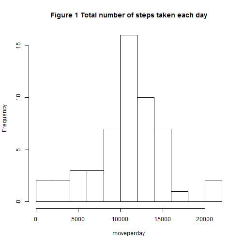
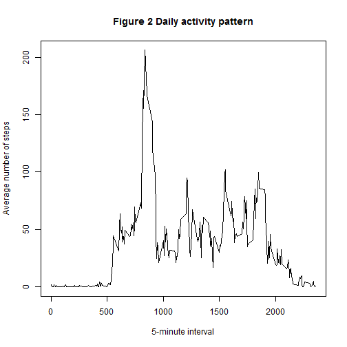
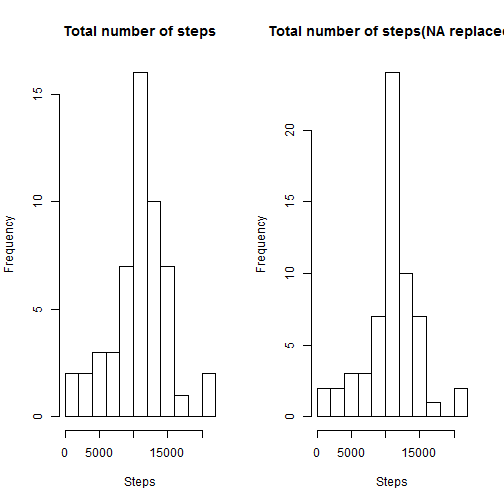
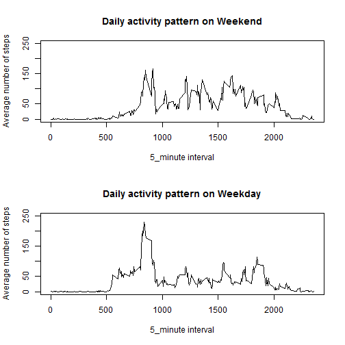

###Introduction

It is now possible to collect a large amount of data about personal movement using activity monitoring devices such as a *Fitbit*, *Nike Fuelband*, or *Jawbone Up*. These type of devices are part of the "quantified self" movement - a group of enthusiasts who take measurements about themselves regularly to improve their health, to find patterns in their behavior, or because they are tech geeks. But these data remain under-utilized both because the raw data are hard to obtain and there is a lack of statistical methods and software for processing and interpreting the data.

This assignment makes use of data from a **personal activity monitoring device**. This device collects data at 5 minute intervals through out the day. The data consists of two months of data from an anonymous individual collected during the months of October and November, 2012 and include the number of steps taken in 5 minute intervals each day.

###Data

The data for this assignment can be downloaded from the course web site:

* **Dataset:** Activity monitoring data

The variables included in this dataset are:

* **steps:** Number of step taking in a 5-minute interval
* **date:** The date on which the measurement was taken
* **interval:** Identifier for the 5-minute interval in which measurment was taken

The dataset is stored in a comma-separated-value (CSV) file and there are a total of **17,568** observations in this dataset.

###**Loading and preprocessing the data**

First, the working directory was set by `setwd()` function.Then the dataset was loaded by `read.csv()` function and stored in the name of *movement* as the following code:


```r
setwd("C:\\VACHIRA\\Coursera\\Reproducible research")
movement <-read.csv("activity.csv", header = TRUE)
```

Since the mode of date variable was factor, then the date variable was transformed by `as.Date()` function


```r
movement$date <- as.Date(movement$date)
```

###**What is mean total number of steps taken per day?**

The total number of step was calculated with `sum()`. In case of NA, `na.rm = TRUE` was used as following code:


```r
sum(movement$steps, na.rm = TRUE)
```

```
## [1] 570608
```

The total number of steps per day was **570608**.

the dataset now was modified to remove the NA values and stored as the name of movement_com (the code was not shown)


The histogram of the total number of steps taken each day was created after aggregation by date and stored as the name of moveperday


```r
moveperday <- tapply(movement_com$steps, movement_com$date, sum)
hist(moveperday, 15, main = "Figure 1 Total number of steps taken each day")
```

 
The mean and median of mean and median of the total number of steps taken per day was calculated by `mean()` and `median()` as following code:


```r
mean(moveperday)
```

```
## [1] 10766.19
```

```r
median(moveperday)
```

```
## [1] 10765
```

###**What is the average daily activity pattern?**

The time series plot (i.e. `type = "l")` was created.


```r
dailymove <-tapply(movement_com$steps, movement_com$interval, mean)
plot(y=dailymove, x = names(dailymove), type = "l", xlab = "5-minute interval",
      main = "Figure 2 Daily activity pattern", ylab = "Average number of steps")
```

 

The maximum number of steps happened on 


```r
dailymove[dailymove == max(dailymove)]
```

```
##      835 
## 206.1698
```

###**Imputing missing values**

All the above analysis was done with the dataset which complete case or no-missing value dtatset. However, the number of row with NA must be known beforehand.

```r
sum(is.na(movement$steps))
```

```
## [1] 2304
```

**2304** 5-minute intervals were missing.Therefore, to impute the missing value would be the alternative way to analys such a dataset.

The new dataset called imp_move was created form movement dataset. Then replacing mean of steps from dailymove datafram in the new dataset. 


```r
imp_move <- movement
imp_move[is.na(imp_move$steps), 1] <- dailymove[as.character(imp_move[is.na(imp_move$steps), 3])]
```

The final step was to check whether NA was replaced.


```r
sum(is.na(imp_move))
```

```
## [1] 0
```

No missing value was in the new dataset.

The histogram of the new dtataset with no missing value was created as following code: 

```r
moveday_new <-tapply(imp_move$steps, imp_move$date, sum)
par(mfrow = c(1,2))
hist(moveperday, 15,main = "Total number of steps", xlab ="Steps")
hist(moveday_new, 15, main = "Total number of steps(NA replaced)",
                   xlab= "Steps")
```

 

Mean and median were calculated


```r
mean(moveday_new)
```

```
## [1] 10766.19
```

```r
median(moveday_new)
```

```
## [1] 10766.19
```

###**Are threr differences in activity patterns between weekdays and weekends?**

The new variable was created as the following code:


```r
imp_move$wd <-weekdays(imp_move$date)
imp_move$fwd <- as.factor(c("weekend", "weekday"))
imp_move[imp_move$wd == "Sunday"| imp_move$wd == "Saturday", 5] <- factor("weekend")
imp_move[!(imp_move$wd == "Sunday"| imp_move$wd == "Saturday"), 5] <- factor("weekday")
```

Then the panel plot was created.

```r
we <-subset(imp_move, fwd =="weekend")
wd <-subset(imp_move, fwd == "weekday")
dailymove_we <-tapply(we$steps,we$interval, mean)
dailymove_wd <-tapply(wd$steps,wd$interval, mean)
par(mfrow =c(2,1))
plot( y=dailymove_we,x = names(dailymove_we), type = "l", xlab = "5_minute interval",
                               main = "Daily activity pattern on Weekend", ylab = "Average number of steps", ylim =c(0,250)) 
plot( y=dailymove_wd,x = names(dailymove_wd), type = "l", xlab = "5_minute interval",
                               main = "Daily activity pattern on Weekday", ylab = "Average number of steps", ylim = c(0, 250)) 
```

 
